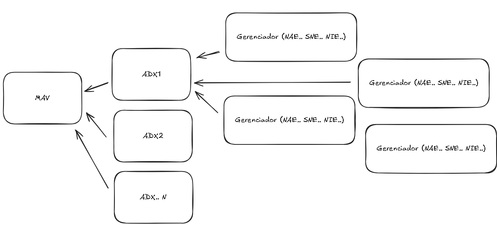

# Metasys Alarm Viewer (MAV)

## 📌 Sobre a aplicação
O **Metasys Alarm Viewer (MAV)** é uma aplicação **frontend em React + TypeScript** projetada para ambientes **on-premise**.  
O objetivo é **centralizar a visualização de alarmes** de múltiplos servidores **ADX/ADS (versão 10 ou superior)** com API habilitada.

Com o MAV é possível:
- ✅ Visualizar **alarmes em tempo real** de vários servidores simultaneamente  
- ✅ **Inserir comentários** em cada alarme (armazenados localmente no navegador)  
- ✅ Alternar entre **modo Tabela** e **modo Cards** para análise  
- ✅ Gerenciar múltiplas APIs (adicionar, remover, ativar/desativar)  
- ✅ Filtrar e ordenar alarmes por site, ponto, valor, prioridade, datas e status  
- ✅ Auto-refresh com contador regressivo  
- ✅ Visualizar **estatísticas em gráficos (pie)** sobre alarmes reconhecidos, descartados e por tempo de idade  

A aplicação foi otimizada com:
- **Arquitetura Limpa (Clean Architecture)** → separando entidades, serviços, casos de uso e UI  
- **Design Atômico** → maior reutilização de componentes visuais  
- **Hooks customizados** → melhor organização de estado, polling e filtros  
- **Persistência local** → comentários e configurações de colunas salvos no `localStorage`  

---

## 🏗️ Arquitetura
src/
├─ alarms/ → Componente principal (UI)
├─ config/ → Configuração de backends (servidores ADX/ADS)
├─ lib/ → Funções utilitárias e DTOs da API
├─ entities/ → Definições de tipos e modelos de domínio
├─ services/ → Cliente de integração com a API Metasys
├─ usecases/ → Casos de uso (ex: carregar alarmes)
├─ hooks/ → Hooks customizados (ex: useAlarms, debounce)
├─ state/ → Armazenamento local (comentários)
├─ utils/ → Funções utilitárias (ex: ordenação estável)
├─ main.tsx → Ponto de entrada React
├─ index.css → Estilos globais

---

## 🚀 Como executar em outro PC

### 🔹 Pré-requisitos

- Toda documentação de como ocorre a interação da API, pode ser acessada pelo link: https://jci-metasys.github.io/api-landing/
- [Node.js](https://nodejs.org/) (versão 18 ou superior recomendada)  
- [npm](https://www.npmjs.com/) (instalado junto com o Node)

### 🔹 Passos
1. **Clonar ou copiar o projeto** para a máquina desejada:
   ```bash
   git clone https://github.com/maiconveiga/MetasysAlarmViewer.git

### Levantar servidores
## Front
# pm2 start "npm run dev -- --host 0.0.0.0 --port 80" --name MAV80
# pm2 start "npm run dev" --name MAV5173
# pm2 serve dist 81 --name MAV

## Back - API Manager
# python3 -m venv env_API_Manager
# source env_API_Manager/bin/activate
# pip3 install -r requirements.txt
# pm2 start ./env_API_Manager/bin/python --name MAV_API_MANAGER --cwd /home/ghrunner/actions-runner/_work/MetasysAlarmViewer/01_MS_API_MANAGER --interpreter none --  -m uvicorn app.main:app --host 0.0.0.0 --port 5000 